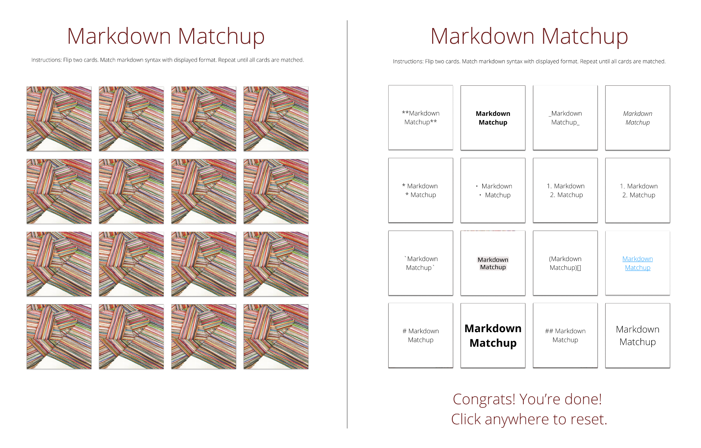

# Markdown Matchup

*Improve your memory, learn to write code.*

## [Click here to play!](https://pages.git.generalassemb.ly/isinsus/game-project/)

## About the game

Markdown Matchup is a memory game that educates players about the syntac for markdown programming. 

Markdown is a lightweight coding language for creating formatted text using a plain-text editor. It is widely used in blogging, instant messaging, online forums, collaborative software, documentation pages, and readme files. By learning the syntax, the symbols used to set the formatting of text, you can easily style your website pages. 

Markdown Memory helps you learn markdown syntax. By looking through cards, you can match pairs of syntax and formatting. For example, "`**markdown matchup**`" bolds the text so it matches with "**markdown matchup**".

## How to play

1. Click **Start** to start the game.
2. Click on two cards to determine if they are a pair:

    * If the two cards are a pair, then both cards will remain flipped up. 
    * If the two cards are NOT a pair, then both cars will flip down.

3. Continue to click on cards until you match all the cards with their pair.
5. When you find all the pairs, click **Start** to play again.

## Next steps
**Polish**
1. Adaptive page and play on mobile
2. Better placement of completion message
3. Add card flip transitions
4. Best time tracker

**Future potential**
1. Upload csv to change card content - and enjoy studying your topic!
